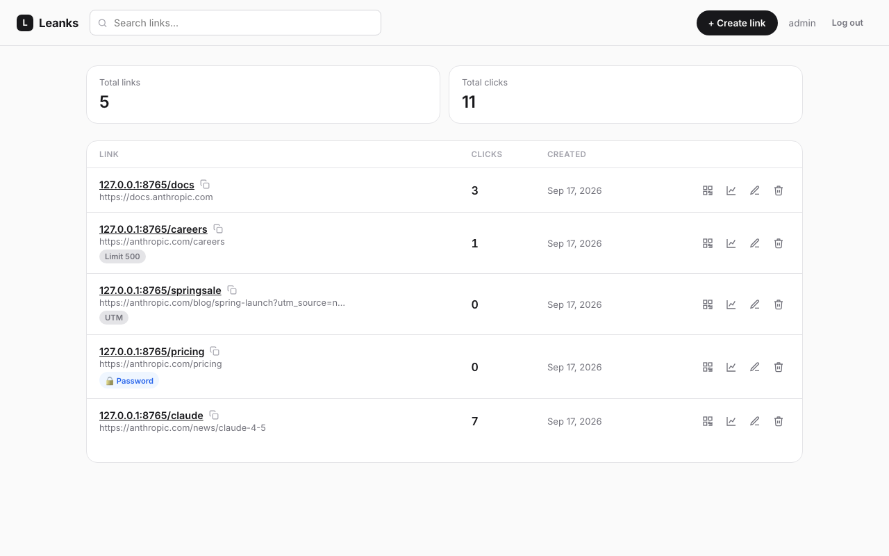
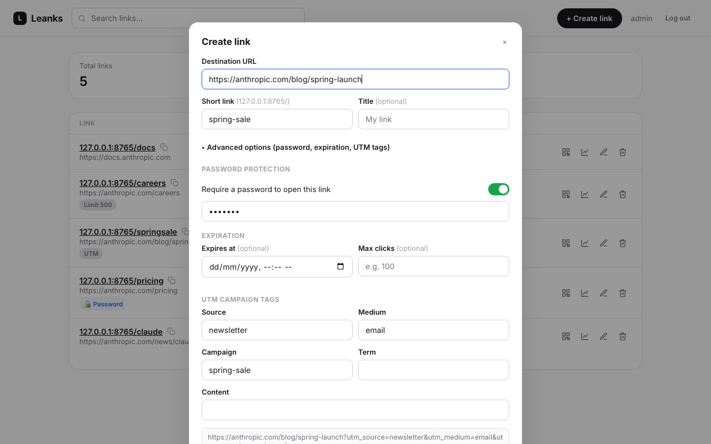

# Leanks

A self-hosted URL shortener with a modern, SaaS-style dashboard, built on top of
[YOURLS](https://yourls.org) so it runs on ordinary PHP/MySQL shared hosting -- no Node build
step, no Docker, no serverless platform required.




Leanks is YOURLS underneath (redirect engine, database, click tracking) with:

- A custom dashboard (vanilla HTML/CSS/JS, no framework) that looks and feels like a modern SaaS
  link manager instead of a classic PHP admin panel.
- **Password-protected links** -- require a password before a short link redirects.
- **Link expiration** -- by date, by max click count, or both.
- **UTM campaign tags** -- a built-in UTM builder with a live preview of the final destination URL.
- **QR codes** -- generated client-side for any link, downloadable as PNG.
- **Analytics** -- a dedicated dashboard page with a clicks chart across 9 time ranges (last 24
  hours through year-to-date, plus a custom range), filters (link, country, continent, device,
  browser, OS, referrer), and ranked breakdowns by short link, destination URL, referrer, UTM
  parameter, country, continent, device, browser and OS.
- **CSV import** -- migrate links from another shortener via CSV, with column auto-detection,
  duplicate/error reporting, and original creation dates preserved.
- **One-click updates** -- the dashboard notices new releases and applies them in place, with an
  automatic backup and checksum verification before anything is touched.

## Why YOURLS underneath

YOURLS is plain PHP, MIT licensed, has no build step, and stores everything in a couple of MySQL
tables -- which makes it a good fit for cheap shared/cPanel hosting. Leanks keeps YOURLS' core
completely stock (redirect logic, database schema, click tracking, plugin API) and adds a small
plugin (`user/plugins/leanks`) plus an entirely custom front end (`app/`) on top, rather than
patching YOURLS' own files. That means YOURLS itself stays upgradeable in place.

The dashboard's visual design is original -- a modern, SaaS-style interface built from scratch in
plain CSS, replacing YOURLS' classic PHP admin panel look without touching YOURLS itself.

## Requirements

- PHP 8.0+
- MySQL 5.7+ or MariaDB, with the `pdo_mysql` extension
- Apache with `mod_rewrite` (for pretty short URLs via `.htaccess`) -- other web servers work too,
  see [YOURLS' own docs](https://docs.yourls.org) for nginx/other rewrite rules

## Installing

1. **Create a MySQL database and database user, and grant that user access to it.** The setup
   wizard connects to an existing database -- on shared/cPanel hosting it typically can't create
   one itself (the DB user usually lacks CREATE privileges), and it definitely can't create MySQL
   users. In cPanel: **MySQL® Databases** -> create a database -> create a user -> **Add User to
   Database** with ALL PRIVILEGES checked. cPanel usually prefixes both the database and user name
   with your account name (e.g. `youraccount_leanks`) -- use the exact names it shows you, not the
   short name you typed when creating them.
2. Upload the contents of this repository to your web root (e.g. `public_html`), keeping the
   folder structure intact.
3. Visit `https://your-domain.com/setup/` in a browser and fill in the database details from step
   1 and an admin username/password. This writes `user/config.php`, creates the database tables,
   and activates the Leanks plugin automatically.
4. **Delete (or password-protect) the `/setup` folder once installed** -- it can rewrite your
   database credentials and shouldn't stay reachable.
5. Go to `https://your-domain.com/app/` and log in with the admin account you just created.

Prefer to configure by hand? Copy `user/config-sample.php` to `user/config.php`, fill in your
settings, then visit `/admin/install.php` (YOURLS' own installer) followed by `/admin/plugins.php`
to activate the "Leanks" plugin.

## Project layout

```
admin/                 Stock YOURLS admin (kept as a fallback/power-user UI)
app/                    The Leanks dashboard (vanilla HTML/CSS/JS)
  auth.php              Thin JSON bridge into YOURLS' own login/session
  index.html, login.html
  css/app.css            Design system (modern SaaS style)
  js/app.js, api.js, login.js
  js/vendor/qrcode.js     Vendored QR code generator (MIT, see licenses/)
includes/               Stock YOURLS core (untouched)
setup/                  Web-based install wizard
user/
  config-sample.php      Manual-install config template
  plugins/leanks/         The plugin: password/expiration/UTM metadata + redirect gating
licenses/               Third-party license texts (YOURLS, qrcode.js)
```

## How the plugin works

Password protection, expiration and click limits are enforced by hooking YOURLS'
`redirect_shorturl` action (see `user/plugins/leanks/includes/redirect-gate.php`): before a click
is logged and redirected, Leanks checks a small metadata table (`{prefix}leanks_meta`, one row per
protected/expiring link) and can intercept the request with a password prompt or an "expired"
page. Everything else -- the redirect itself, click counting, referrer/geo logging -- is stock
YOURLS.

The dashboard talks to YOURLS' existing `admin-ajax.php` for link create/edit/delete (reusing its
built-in nonce-based CSRF protection and session auth), plus a handful of custom `leanks_*`
actions the plugin registers on the same endpoint for listing, stats, metadata, and CSV import.

### CSV import

`user/plugins/leanks/includes/import.php` parses the uploaded file server-side with PHP's own CSV
parser and auto-detects columns by matching common header aliases (`url`/`destination url`,
`short link`/`key`/`slug`, `title`/`name`, `creation date`/`created at`, etc.) case-insensitively --
it doesn't require exact header names, so column order and naming don't need to match exactly.
Each row is created through the same `yourls_add_new_link()`
YOURLS itself uses, so duplicate URLs/keywords are caught the normal way and reported back per-row
rather than aborting the whole import; a supplied creation date is applied afterwards. Files over
2000 rows are processed in the first batch only -- re-upload the remainder in a second pass.

### Updating

`user/plugins/leanks/includes/update.php` polls `https://api.github.com/repos/creixems/leanks/releases/latest`
(throttled to once every 24h) and shows a dashboard banner when a newer version is published.
Clicking **Update now** downloads that release's zip, verifies it against the checksum published
alongside it, backs up every file about to change, then applies the diff between the previous and
new release manifests (added/changed files are written, files removed upstream are deleted).
Nothing is applied until the checksum check passes and the backup succeeds; if applying the update
itself fails partway through, it's rolled back from that backup automatically. Past backups are
listed in the update modal with a manual **Restore** action, and the 3 most recent are kept.

Two things are deliberately never touched by an automated update: `user/config.php` (never part of
any release) and `.htaccess` (skipped if it differs from the shipped version, with the new version
saved to `user/leanks-updates/htaccess.new` for you to merge by hand) -- so a customized rewrite
config or local site settings are never silently overwritten. This requires the `ZipArchive` PHP
extension; hosts without it get a clear message instead of a broken update.

Releases are built by [`.github/workflows/release.yml`](.github/workflows/release.yml): pushing a
`vX.Y.Z` tag (after bumping `LEANKS_VERSION` in
[`version.php`](user/plugins/leanks/includes/version.php) to match) builds a zip of every
git-tracked file, a `manifest.json` of that file list, and a `sha256` checksum, and attaches them
to a **draft** GitHub release. Drafts are invisible to `/releases/latest`, so publishing is a
separate, deliberate step after writing release notes.

## Local development

No build step -- edit files and reload. To run it locally you need PHP and MySQL/MariaDB, e.g.:

```bash
php -S 127.0.0.1:8000 router.php   # see below for router.php
```

Since `php -S` doesn't read `.htaccess`, use a tiny router script that mirrors it for local testing:

```php
<?php
// router.php (dev only)
$root = $_SERVER['DOCUMENT_ROOT'];
$path = parse_url($_SERVER['REQUEST_URI'], PHP_URL_PATH);
$file = $root . $path;
if ($path !== '/' && (is_file($file) || is_dir($file))) return false;
require $root . '/yourls-loader.php';
```

Then visit `http://127.0.0.1:8000/setup/` to install against your local database.

## License

MIT -- see [LICENSE](LICENSE). Bundles YOURLS and qrcode.js, both MIT licensed; see
[licenses/](licenses/) for their original license texts.
